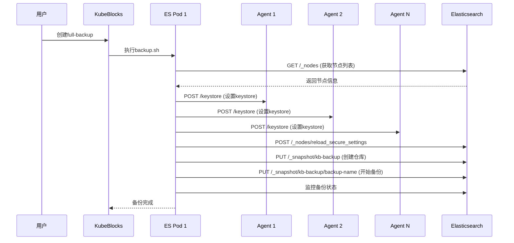

# Elasticsearch Agent 实现方案

## 概述

本方案通过为每个Elasticsearch pod添加一个轻量级的agent代理容器，简化了备份流程。Agent只负责设置本地节点的S3凭证，备份的主流程仍然在原有的backup.sh脚本中执行，保持了最大的灵活性。

## 问题背景

### 原有流程的问题
1. **操作复杂**: 需要先执行setup-keystore设置所有节点的ak、sk，然后再执行full-backup
2. **时序依赖**: 必须等所有节点都设置完keystore后才能开始备份
3. **用户体验差**: 需要用户手动执行两个步骤，容易出错

### 解决方案
通过agent代理容器提供简单的HTTP API，实现：
1. **统一流程**: 在backup.sh脚本中自动完成keystore设置和备份
2. **自动协调**: 脚本自动发现集群节点并调用agent设置keystore
3. **简化操作**: 用户只需执行一个backup命令

## 架构设计

```
┌─────────────────────────────────────────────────────────────┐
│                    Elasticsearch Cluster                    │
├─────────────────┬─────────────────┬─────────────────────────┤
│   Pod 1         │   Pod 2         │   Pod N                 │
│ ┌─────────────┐ │ ┌─────────────┐ │ ┌─────────────────────┐ │
│ │Elasticsearch│ │ │Elasticsearch│ │ │   Elasticsearch     │ │
│ │ Container   │ │ │ Container   │ │ │    Container        │ │
│ └─────────────┘ │ └─────────────┘ │ └─────────────────────┘ │
│ ┌─────────────┐ │ ┌─────────────┐ │ ┌─────────────────────┐ │
│ │   Agent     │ │ │   Agent     │ │ │       Agent         │ │
│ │ Container   │ │ │ Container   │ │ │     Container       │ │
│ │  :8080      │ │ │  :8080      │ │ │       :8080         │ │
│ └─────────────┘ │ └─────────────┘ │ └─────────────────────┘ │
└─────────────────┴─────────────────┴─────────────────────────┘
         │                 │                       │
         └─────────────────┼───────────────────────┘
                           │
                    HTTP API 调用
                  (设置keystore)
```

## 实现组件

### 1. Agent容器 (`addons/elasticsearch/agent/`)

#### 文件结构
```
agent/
├── main.go           # Agent主程序（简化版）
├── go.mod           # Go模块定义
├── Dockerfile       # 容器镜像构建
├── build.sh         # 构建脚本
└── README.md        # 使用说明
```

#### 核心功能
- **HTTP API服务**: 提供keystore设置接口
- **本地keystore管理**: 调用elasticsearch-keystore命令设置S3凭证
- **认证支持**: 支持Elasticsearch集群的认证机制

#### API接口
- `GET /health`: 健康检查
- `POST /keystore`: 设置本地节点的keystore

### 2. 备份和恢复脚本更新

#### backup.sh 新增功能
- 获取集群节点信息
- 调用各节点agent API设置keystore
- 继续执行原有备份流程

#### restore.sh 新增功能
- 获取集群节点信息
- 调用各节点agent API设置keystore
- 继续执行原有恢复流程

### 3. ComponentDefinition更新

#### 修改内容
- 在elasticsearch和exporter容器基础上添加agent容器
- 配置agent容器的环境变量和卷挂载
- 添加agent服务端口配置

### 4. 配置简化

#### 删除的组件
- `elasticsearch-setup-keystore` ActionSet
- `elasticsearch-unified-backup` ActionSet
- `setup-keystore` 备份方法
- `unified-backup` 备份方法

#### 保留的组件
- `elasticsearch-physical-backup` ActionSet（使用更新后的backup.sh）
- `full-backup` 备份方法

## 工作流程

### 简化的备份流程



### 关键步骤说明

1. **节点发现**: backup.sh脚本调用`/_nodes` API获取集群中所有节点的IP地址
2. **并行设置**: 脚本并行调用所有节点的agent `/keystore` API设置S3凭证
3. **安全重载**: 调用`/_nodes/reload_secure_settings`使keystore生效
4. **继续备份**: 执行原有的备份逻辑（创建仓库、开始备份、监控状态）

## 部署配置

### Agent容器配置
```yaml
- name: agent
  image: apecloud/elasticsearch-agent:latest
  ports:
  - name: agent
    containerPort: 8080
  env:
  - name: ELASTIC_USERNAME
    value: "elastic"
  - name: ELASTIC_PASSWORD
    value: "$(ELASTIC_USER_PASSWORD)"
  - name: AGENT_PORT
    value: "8080"
  volumeMounts:
  - mountPath: /usr/share/elasticsearch/bin
    name: local-bin
  - mountPath: /usr/share/elasticsearch/config
    name: local-config
  - mountPath: /usr/share/elasticsearch/data
    name: data
```

## 使用方法

### 简化的使用方式
```bash
# 一步完成keystore设置和备份
kubectl create backup my-backup --backup-method full-backup
```

### 对比原有方式
```bash
# 原有方式（两步）
kubectl create backup setup-keystore --backup-method setup-keystore
kubectl create backup full-backup --backup-method full-backup

# 新方式（一步）
kubectl create backup my-backup --backup-method full-backup
```

## 优势

1. **简化架构**: Agent只负责keystore设置，职责单一
2. **保持灵活性**: 备份主流程仍在脚本中，易于维护和扩展
3. **用户体验**: 从两步操作简化为一步
4. **向后兼容**: 不破坏现有的备份逻辑
5. **轻量级**: Agent资源消耗极小

## 安全考虑

1. **网络隔离**: Agent只在集群内部通信
2. **认证传递**: 使用与Elasticsearch相同的认证机制
3. **凭证安全**: S3凭证仅在内存中临时存储
4. **最小权限**: Agent以非root用户运行

## 监控和故障排除

### 健康检查
```bash
# 检查agent状态
curl http://<pod-ip>:8080/health
```

### 日志查看
```bash
# 查看agent日志
kubectl logs <pod-name> -c agent

# 查看备份日志
kubectl logs <backup-job-pod>
```

### 常见问题
1. **Agent启动失败**: 检查镜像和环境变量
2. **Keystore设置失败**: 检查卷挂载和权限
3. **节点通信失败**: 检查网络和认证配置
4. **备份失败**: 检查S3配置和网络连接

## 性能影响

### 资源消耗
- **CPU**: Agent容器消耗很少CPU资源
- **内存**: 约30-50MB内存占用
- **网络**: 仅在备份时有短暂的节点间通信

### 备份性能
- **启动时间**: 减少了手动协调的时间
- **并发设置**: 并行设置所有节点的keystore
- **总体时间**: 相比原有流程，总时间显著减少

## 构建和部署

### 构建Agent镜像
```bash
cd addons/elasticsearch/agent
./build.sh push
```

### 部署Elasticsearch集群
```bash
# 安装addon
helm install elasticsearch ./addons/elasticsearch

# 创建集群
kubectl apply -f cluster.yaml
```

## 总结

这个简化的实现方案：
1. **保持了原有备份脚本的灵活性**
2. **简化了用户操作流程**
3. **减少了系统复杂性**
4. **提供了更好的用户体验**

Agent只专注于keystore设置这一个功能，备份的主要逻辑仍然在经过验证的backup.sh脚本中，这样既解决了用户的痛点，又保持了系统的稳定性和可维护性。
