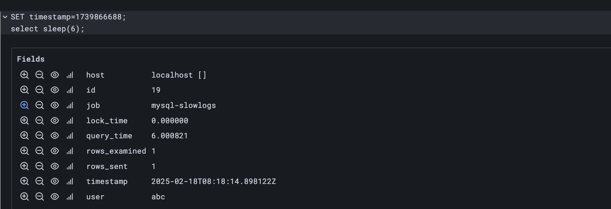

## How to Deploy PLG Stack on Kubernetes

**PLG stack** here refers to Promtail, Loki and Grafana, where Promtail extracts and collects logs from docker containers log files and pushes them to the Loki service which then Grafana uses to show logs in the log panel.

### Install Loki Stack

In this tutorial, we will show how to deploy them using loki-stack helm chart.
The Loki stack is a lightweight log aggregation solution from Grafana.

**Step 1.** Add the Grafana Helm Chart repository and Update repo:

```bash
# Add Grafana's Helm Chart repository and Update repo :
helm repo add grafana https://grafana.github.io/helm-charts
helm repo update
```

**Step 2.** Install Loki Stack:

If you have prometheus and Grafana already installed, you may deploy the loki stack with values as follows:

```yaml
# cat values.yaml
loki:
  enabled: true
  url: http://loki-stack.logging:3100
  image:
    tag: 2.9.3  # set image tag to 2.8.10 or higher to fix the issue 'Failed to load log volume for this query'
  persistence:
    enabled: true # set to true to persist logs

promtail:
  enabled: true
  config:
    clients:
      - url: http://loki-stack.logging:3100/loki/api/v1/push # set loki url, don't forget the `namespace` of loki service
```

```bash
# Deploy the Loki stack to namespace logging. customize the values.yaml as needed.
helm upgrade --install loki-stack grafana/loki-stack -n logging --create-namespace -f values.yaml
```

For more details please refer to [loki stack](https://github.com/grafana/helm-charts/tree/main/charts/loki-stack).

> [!IMPORTANT]
> If you are deploying the stack with loki version 2.6.1, you may encounter the error 'Failed to load log volume for this query'.
> To fix the issue, you should upgrade the loki version to 2.8.10 or higher, as discussed in the [issue](https://github.com/grafana/grafana/issues/84144).

**Step 3.** Check Status:

```bash
kubectl get pods -n logging #Check pod status:
```

Wait for a while till all the pods are `runniing` and check pod logs for any errors:

```bash
kubectl -n logging logs statefulsets/loki-stack # check loki logs
kubectl -n logging logs daemonsets/loki-stack-promtail # check promtail logs
```

### Configure Loki in Grafana

#### Step 1. Add Loki Data Source to Grafana

> [!NOTE]
> Install Prometheus and Grafana if you haven't already. You can refer to the [Prometheus and Grafana](./install-prometheus.md) guide.

Visit Grafana Dashboard in your browser and Go to `Home` -> `Connections` -> `Data Sources` -> `Add new data source` -> `Loki` and fill in the following details:

- **Name**: Loki
- **URL**: `http://loki-stack.logging:3100/`, where `logging` is the namespace where Loki is deployed.

Click on `Save & Test` to save the data source.

Then click on `Home` > `Explore` then choose `Loki` as the data source to filter labels and run queries, say `{namespace="default",stream="stdout"}` to see the logs.

If you encounter the `Failed to load log volume for this query` error, please upgrade the loki version to 2.8.10 or higher.

#### Step 2. Import a Loki Dashboard for Logs

You can import a Loki dashboard to visualize logs in Grafana or create your own dashboard.

- [Container Log Dashboard](https://grafana.com/grafana/dashboards/16966-container-log-dashboard/) from Grafana Dashboards
- [Container Log Trends](./misc/loki-container-logs.json) from the `docs/misc` folder.

More dashboards can be found at [Grafana Dashboards](https://grafana.com/grafana/dashboards).

## [Optional] Configure Promtail to Collect MySQL Error Logs

In this section, we will show how to configure Promtail to collect MySQL error logs.
Create a MySQL Cluster if you haven't already, refer to the [KubeBlocks MySQL Cluster](../mysql/README.md) guide.

MySQL will write its error logs to a file, say `/var/log/mysql/error.log`. To Check the log file location of MySQL, you can run the following command:

```sql
show variables like '%log_file';
```

<details>
<summary>Expected Output:</summary>

```bash
+---------------------+-----------------------------------------+
| Variable_name       | Value                                   |
+---------------------+-----------------------------------------+
| audit_log_file      | /var/lib/mysql/auditlog/audit.log       |
| general_log_file    | /var/lib/mysql/log/mysqld.log           |
| slow_query_log_file | /var/lib/mysql/log/mysqld-slowquery.log |
+---------------------+-----------------------------------------+
```

</details>

We will configure Promtail to collect these logs and push them to Loki, before you start, you should understand where the MySQL logs are stored and the log format.

> [!IMPORTANT]
> Before you start:
>
> - Check the path of the MySQL log file on the **host node**.
> - Ensure Promtail mounts the directory (`extraVolumes` and `extraVolumeMounts`) and has the necessary permissions to read the log files (`podSecurityContext`).

Here is an example of how to configure Promtail to collect MySQL  logs, we will explain the configuration in detail. You may get a full list of Promtail configuration options [here](./misc/plg-stack-values-sample.yaml)).

```yaml
# cat values.yaml
loki:
  enabled: true
  url: http://loki-stack.logging:3100
  image:
    tag: 2.9.3
  persistence:
    enabled: true

promtail:
  enabled: true
  podSecurityContext:
    runAsUser: 0
    runAsGroup: 0
    fsGroup: 0  # add fsGroup to allow promtail to read logs from the host. Set to the group id of the user that has access to the log files

  extraVolumes:  # mount the local-path-provisioner volume to promtail. Set the path to the directory where the MySQL error logs are stored.
    - name: localpv
      hostPath:
        path: "/var/local-path-provisioner"
  extraVolumeMounts:
    - name: localpv
      mountPath: "/var/local-path-provisioner"
      readOnly: true
  config:
    clients:
      - url: http://loki-stack.logging:3100/loki/api/v1/push
    snippets:
      scrapeConfigs: |
        - job_name: mysql-logs
          static_configs:
            - targets:
                - localhost
              labels:
                job: mysql-logs
                __path__: /var/local-path-provisioner/*/log/mysqld-error.log*  # Specify the path pattern for MySQL error logs w.r.t your Storage Provider

          # Define processing stages for the collected logs
          pipeline_stages:
            - match:
                selector: '{job="mysql-logs"}'
                stages:
                  - regex:  # Extract metadata from the log file path using regex, must set source to filename
                      expression: '/var/local-path-provisioner/(?P<pvc_name>pvc-[^_]+)_(?P<namespace>[^_]+)_data-(?P<pod_name>[^/]+)/log/mysqld-error.log.*'
                      source: filename
                  - labels:
                      namespace:
                      pod_name:
            - regex:  # Parse the log line content using regex
                expression: '^(?P<timestamp>[^ ]+) (?P<thread_id>\d+) \[(?P<level>[^\]]+)\] \[(?P<error_code>[^\]]+)\] \[(?P<source>[^\]]+)\] (?P<message>.*)$'
            - timestamp:  # Extract and format the timestamp from the log
                source: timestamp
                format: RFC3339Nano
            - labels:  # Add additional labels from the parsed log content
                level:
                error_code:
            - labeldrop:
              - filename
            - output:  # Define the final output of the log processing
                source: message

        - job_name: mysql-csi-logs
          static_configs:
            - targets:
                - localhost
              labels:
                job: mysql-csi-logs
                __path__: /var/lib/kubelet/pods/*/volumes/kubernetes.io~csi/*/mount/log/mysqld-error.log*  # Specify the path pattern for MySQL error logs w.r.t your Storage Provider

          # Define processing stages for the collected logs
          pipeline_stages:
            - match:
                selector: '{job="mysql-csi-logs"}'
                stages:
                  - regex:
                      expression: '/var/lib/kubelet/pods/(?P<pod_uid>[^/]+)/volumes/kubernetes.io~csi/(?P<pvc_name>[^/]+)/mount/log/mysqld-error.log.*'
                      source: filename
                  - labels:
                      pod_uid:
                      pvc_name:
            - regex:  # Parse the log line content using regex
                expression: '^(?P<timestamp>[^ ]+) (?P<thread_id>\d+) \[(?P<level>[^\]]+)\] \[(?P<error_code>[^\]]+)\] \[(?P<source>[^\]]+)\] (?P<message>.*)$'
            - timestamp:  # Extract and format the timestamp from the log
                source: timestamp
                format: RFC3339Nano
            - labels:  # Add additional labels from the parsed log content
                level:
                error_code:
            - labeldrop:
              - filename
            - output:  # Define the final output of the log processing
                source: message
```

This Promtail configuration defines two jobs:

- **mysql-logs**: Collects MySQL error logs from local-path-provisioner
  - Captures MySQL error logs stored in a local path provisioner in Kubernetes.
  - Extracts metadata, such as, namespace and pod name from filename, error level and error codes from logs content.
- **mysql-csi-logs**: Collects MySQL logs stored in CSI-based persistent volumes, akin to `mysql-logs` job, but differs in the `path` pattern.

In each job, we defined as sequence of processing stages to parse the logs. Multiple stages can be chained together to process logs in a sequence.
The stages are executed in the order they are defined in the configuration file. The output of one stage is passed as input to the next stage. Please refer to the [Promtail pipeline stages](https://grafana.com/docs/loki/latest/send-data/promtail/stages/) for more details.
Frequently used stages are as follows:

- Parsing Stage:
  - regex: Extracts metadata from the log line using regex
  - json: Parses the log line content as JSON
  - multiline: Merges multiple lines into a single multiline block, then passes it to the next stage in the pipeline. It identifies new blocks by matching the first line with the firstline regex. Any line that does not match this expression is considered part of the previous matching block.
- Transform Stage:
  - template:  Use Go templates to modify extracted data.
- Action Stages:
  - labels: Adds additional labels from the parsed log content
  - timestamp: Extracts and formats the timestamp from the log
  - output: Defines the final output of the log processing
  - labeldrop: Drops the specified labels from the log entry
- Filtering Stages:
  - drop: Drops the log entry if the expression matches

To deploy the updated configuration, run the following command:

```bash
helm upgrade --install loki-stack grafana/loki-stack -n logging --create-namespace -f values.yaml
```

Now you can see the MySQL error logs in Grafana, and explore them using the Loki query language.

1. Open Grafana in your browser (Loki has been added as a data source in previous steps)
1. Go to `Home` -> `Explore` -> `Loki` and run the query `{job="<JOBNAME>"}` to see the logs, where `<JOBNAME>` is one of those defined in the Promtail configuration.
1. Customize the `pipeline_stages` section to collect and parse the logs as needed.

If everything is set up correctly, you should see the logs in the Explore view as shown below:

- slow query logs:
  
- running logs:
  
- audit logs: (if enabled, see the appendix for parsing audit logs)
  

## Appendix

### Parse MySQL Audit Logs

Here is an example of how to parse MySQL audit logs using Promtail.
Before you start, make sure you

- have enabled the MySQL audit plugin and,
- set the audit log file path in the MySQL configuration file, and
- you understand the log format.

For instance, the MySQL audit log file path is `/var/lib/mysql/auditlog/audit.log`, and the log format is as follows:

```xml
<AUDIT_RECORD
NAME="Query"
RECORD="2035_2025-02-18T03:08:36"
TIMESTAMP="2025-02-18T05:09:01Z"
COMMAND_CLASS="select"
CONNECTION_ID="14"
STATUS="0"
SQLTEXT="select @@global.hostname, @@global.version, @@global.read_only, @@global.binlog_format, @@global.log_bin, @@global.log_slave_updates"
USER="someuser @ [123.456.789]"
HOST="123.456.789"
OS_USER="some"
IP="123.456.789"
DB="somedb"
/>
```

It is a multiline log format, where each log entry starts with `<AUDIT_RECORD` and ends with `/>`, and contains multiple fields like `NAME`, `RECORD`, `TIMESTAMP`, `COMMAND_CLASS`, `CONNECTION_ID`, `STATUS`, `SQLTEXT`, `USER`, `HOST`, `OS_USER`, `IP`, and `DB`.
We use the regex stage to extract metadata from the log file path and the regex stage to parse the log content. You MUST customize the regex expressions to match your log format. And for troubleshooting, you can verify the regex expressions using [regex101](https://regex101.com/).

```yaml
- job_name: mysql-audit-logs
  static_configs:
    - labels:
        job: mysql-audit-logs
        __path__: /var/local-path-provisioner/*/auditlog/audit.log*
  pipeline_stages:
    - match:
        selector: '{job="mysql-audit-logs"}'
        stages:
          - regex:  # Extract metadata from the log file path using regex, must set source to filename
              expression: '/var/local-path-provisioner/(?P<pvc_name>pvc-[^_]+)_(?P<namespace>[^_]+)_data-(?P<pod_name>[^/]+)/auditlog/audit.log.*'
              source: filename
          - labels:
              namespace:
              pod_name:
    - multiline:
        firstline: '^\s*<AUDIT_RECORD'  # Start of a new log entry
        max_wait_time: 3s               # Maximum time to wait for the next line
    - regex:
        expression: '<AUDIT_RECORD\s+NAME="(?P<name>[^"]+)"\s+RECORD="(?P<record>[^"]+)"\s+TIMESTAMP="(?P<timestamp>[^"]+)"\s+COMMAND_CLASS="(?P<command_class>[^"]+)"\s+CONNECTION_ID="(?P<connection_id>[^"]+)"\s+STATUS="(?P<status>[^"]+)"\s+SQLTEXT="(?P<sqltext>[^"]+)"\s+USER="(?P<user>[^"]+)"\s+HOST="(?P<host>[^"]*)"\s+OS_USER="(?P<os_user>[^"]*)"\s+IP="(?P<ip>[^"]*)"\s+DB="(?P<db>[^"]*)"\s*\/>'
    - labels:
        name: name
        record: record
        timestamp: timestamp
        command_class: command_class
        connection_id: connection_id
        status: status
        sqltext: sqltext
        user: user
        host: host
        os_user: os_user
        ip: ip
        db: db

    - labeldrop:
      - filename

    - output:  # Define the final output of the log processing
        source: sqltext
```

### Parse MySQL Slow Logs

Here is an example of how to parse MySQL slow logs using Promtail. It uses `multline` to merge multiple lines into a single multiline block, starting with `#\sTime:.*`, and `regex` to parse the log content. You MUST customize the regex expressions to match your log format.

```yaml
- job_name: mysql-slowlogs
  static_configs:
    - labels:
        job: mysql-slowlogs
        __path__: /var/local-path-provisioner/*/log/mysqld-slowquery.log*
  pipeline_stages:
    - multiline:
        firstline: '#\sTime:.*'
    - regex:
        expression: '#\s*Time:\s*(?P<timestamp>.*)\n#\s*User@Host:\s*(?P<user>[^\[]+).*@\s*(?P<host>.*]).*Id:\s*(?P<id>\d+)\n#\s*Query_time:\s*(?P<query_time>\d+\.\d+)\s*Lock_time:\s*(?P<lock_time>\d+\.\d+)\s*Rows_sent:\s*(?P<rows_sent>\d+)\s*Rows_examined:\s*(?P<rows_examined>\d+)\n(?P<query>(?s:.*))$'
    - labels:
        timestamp:
        user:
        host:
        id:
        query_time:
        lock_time:
        rows_sent:
        rows_examined:
    - drop:
        expression: "^ *$"
        drop_counter_reason: "drop empty lines"
    - labeldrop:
      - filename
    - output:  # Define the final output of the log processing
        source: query
```

### Install and Config Alloy

Alloy is a flexible, vendor-neutral telemetry collector[^2]. As Promtail is expected to reach EOL on March 2, 2026[^1], one may want to migrate from Promtail to Alloy.

Before installing Alloy, please convert Promtail configuration to Alloy, and create a ConfigMap from the file:

```bash
# you may get promtail config with :  kubectl -n logging get secrets loki-stack-promtail -oyaml | yq '.data."promtail.yaml"' |base64 -d > promtail.config
alloy convert --source-format=promtail --output=alloy.config promtail.config
kubectl -n logging create configmap alloy-config --from-file config.alloy=./alloy.config
```

Then install Alloy with values:

```yaml
# cat alloy.values.yaml
alloy:
  configMap:
    create: false
    name: alloy-config
    key: config.alloy
  securityContext:
    allowPrivilegeEscalation: true
    privileged: true
  mounts:
    # -- Mount /var/log from the host into the container for log collection.
    varlog: false
    # -- Mount /var/lib/docker/containers from the host into the container for log
    # collection.
    dockercontainers: false

    # -- Extra volume mounts to add into the Grafana Alloy container. Does not
    # affect the watch container.
    extra:
      - name: kubelet
        mountPath: "/var/lib/kubelet/pods"
        readOnly: true
        mountPropagation: Bidirectional
controller:
  volumes:
    # -- Extra volumes to add to the Grafana Alloy pod.
    extra:
      - name: kubelet
        hostPath:
          path: "/var/lib/kubelet/pods"
```

```bash
helm repo add grafana https://grafana.github.io/helm-charts
helm repo update
helm install --namespace logging alloy grafana/alloy -f alloy.value.yaml --create-namespace
```

## Reference

[^1]: Promtail, <https://grafana.com/docs/loki/latest/send-data/promtail/>
[^2]: Alloy, <https://grafana.com/docs/alloy/latest/introduction/>
